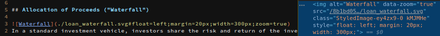

# gatsby-remark-image-attributes

Creates HTML image markup with style and data-* attributes from 'image' nodes with attributes, as parsed by [remark-image-attributes](https://github.com/rbeer/remark-image-attributes.git).

The plugin plays nicely with other image-processing plugins like [gatsby-remark-images](https://github.com/gatsbyjs/gatsby/master/packages/gatsby-remark-images/), amending their generated markup.



Try the [demo](https://remark-image-attributes.netlify.app/)!

## Installation

```bash
npm install --save gatsby-remark-image-attributes
```

## How to use

Add `gatsby-remark-image-attributes` as plugin to [gatsby-transformer-remark](https://github.com/gatsbyjs/gatsby/tree/master/packages/gatsby-transformer-remark) in _gatsby-config.js_

```js
plugins: [
  {
    resolve: `gatsby-transformer-remark`,
    options: {
      plugins: [
        {
          resolve: `gatsby-remark-image-attributes`,
          options: {

            // ?Boolean=true
            //   If true (the default), all CSS
            //   property names will be recognized
            //   as styleAttribute.
            styleAttributes: true,

            // ?Boolean=false
            //   If true, all attributes that
            //   aren't styleAttributes, will be
            //   added as data-* attributes to the
            //   image.
            dataAttributes: false
          }
        }
      ]
    }
  }
],
```

Now you can add attribute declarations as hash value to an image's URL:

```md

```

The resulting HTML will be:

```html

```

## Options

|Name|Type|Default|Description|
|:-:|:-:|:-:|-|
| [styleAttributes](#styleattributes) | Boolean | `true` | Set to `false` if you want to disable [CSS properties](https://www.w3.org/Style/CSS/all-properties.en.html#list) being added to the images style attribute.
| [dataAttributes](#dataattributes) |Boolean| `false` | Set to `true` if you want attributes not recognized as styleAttribute to be added as data- attribute to the image.

#### .gatsby-img-attributes

Generated markup has a CSS class `gatsby-img-attributes`. The plugin itself does not come with any attributes for that class; you can use it to apply default styling to all images with attributes.

#### styleAttributes

***NOTE:*** `options.styleAttributes` used to accept an `Array<String>`, its items extending a default set of recognized properties, e.g. `styleAttributes: ['position', 'top', 'left']`. This still works, but sets `styleAttributes: true`, enabling all CSS properties.

The plugin uses a [list of all CSS properties](https://github.com/rbeer/gatsby-remark-image-attributes/blob/master/src/css-props.json), as defined by the [W3C](https://www.w3.org/Style/CSS/all-properties.en.html), to decide whether an attribute is to be added to the image's style or not.

#### dataAttributes

When `options.dataAttributes` is `true`, the plugin will add all attributes whose key isn't a [CSS property](https://www.w3.org/Style/CSS/all-properties.en.html#list) as data-* attribute to the image.

_gatsby-config.js_:

```js
plugins: [
  {
    resolve: `gatsby-transformer-remark`,
    options: {
      plugins: [
        {
          resolve: `gatsby-remark-image-attributes`,
          options: {
            dataAttributes: true
          }
        }
      ]
    }
  }
];
```
_md_:

```md

```
Where `position` and `height` are recognized as `styleAttributes`, `tool-tip` is not and thus applied as `data-` attribute:

```html

```

With `options.styleAttributes === false`, valid [CSS properties](https://www.w3.org/Style/CSS/all-properties.en.html#list) become `data-` attributes:

```js
plugins: [
  {
    resolve: `gatsby-transformer-remark`,
    options: {
      plugins: [
        {
          resolve: `gatsby-remark-image-attributes`,
          options: {
            styleAttributes: false,
            dataAttributes: true
          }
        }
      ]
    }
  }
];
```
```md

```
```html

```
### use with gatsby-remark-images

This plugin can handle already processed images (type: 'html'), as long as the node object contains an `attributes` field and the `value` an `` tag.

So using other image processing plugins, like [gatsby-remark-images](https://github.com/gatsbyjs/gatsby/master/packages/gatsby-remark-images/), is possible:

_gatsby-config.js_

```js
plugins: [
  {
    resolve: `gatsby-transformer-remark`,
    options: {
      plugins: [
        {
          resolve: 'gatsby-remark-images',
          options: {
            backgroundColor: 'none',
            disableBgImage: true
          }
        },
        {
          resolve: `gatsby-remark-image-attributes`,
          options: {
            dataAttributes: true
          }
        }
      ]
    }
  }
]
```

and

```md

```

generates

```html
<span
  style="display:block; box-shadow: 2px 2px 6px 0px; float: right;"
  class="gatsby-img-attributes"
>
  <span class="gatsby-resp-image-wrapper" ...>
    <span class="gatsby-resp-image-background-image" ...></span>
    </span>
</span>
```

You might have noticed that `styleAttributes` and `class="gatsby-img-attributes"` have been applied to the wrapping `<span>` here, rather than the ``. . See [demo#positioning](https://remark-image-attributes.netlify.app/#positioning) and this [issue comment](https://github.com/rbeer/gatsby-remark-image-attributes/issues/5#issuecomment-690301135) for why this is necessary.

`dataAttributes`, on the other hand, are _always_ applied to the ``.

### use with gatsby-plugin-mdx

Add `gatsby-remark-image-attributes` to [`options.gatsbyRemarkPlugins`](https://www.gatsbyjs.com/plugins/gatsby-plugin-mdx/#gatsby-remark-plugins) of `gatsby-plugin-mdx`.

_gatsby-config.js_
```js
{
      resolve: "gatsby-plugin-mdx",
      options: {
        extensions: [".mdx", ".md"],
        gatsbyRemarkPlugins: [
          {
            resolve: "gatsby-remark-copy-linked-files",
            options: {
              ignoreFileExtensions: ["png", "jpg", "jpeg"]
            }
          },
          {
            resolve: "gatsby-remark-images",
            options: {
              backgroundColor: "none",
              disableBgImage: true,
              linkImagesToOriginal: false
            }
          },
          {
            resolve: "gatsby-remark-image-attributes",
            options: {
              // styleAttributes: true,
              // dataAttributes: false
            }
          }
        ]
      }
    },
```
